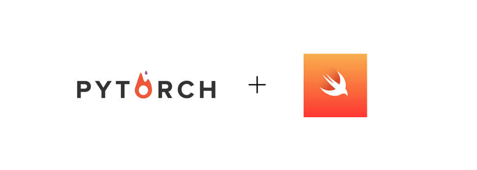

<p align=center></p>
<p align=center>A Swift Wrapper for  PyTorch and Torchvision.</p>


## Getting Started 
**Note**: This project is not affiliated with PyTorch and is still in early development. 

### Prerequisites:  
This library requires Xcode toolchain Swift for [Tensorflow release/Swift 5](https://swift.org/download/)

### Installing with Swift Package Manager: 
Add the following line to your dependencies in `Package.swift` file
```
.package(url: "https://github.com/codeamt/PyTorchSwift.git", .branch("master")),

```

## Usage

### Importing: 

```
import Foundation 
import Python
import PyTorch4Swift 

let torch = PyTorchSwift()
let torchvision = TorchVisionSwift()

```
**Note**: If you have trouble or get errors importing Python (even after upgrading your toolchain), try changing your build system to legacy: File > Project Settings> Build System -> Legacy
### Data Preprocessing:  
```
var transforms_list:[PythonObject] = [torchvision.transforms.ToTensor(),
                                      torchvision.transforms.Normalize([0.5, 0.5, 0.5], [0.5, 0.5, 0.5])]

let transforms = torchvision.transforms.Compose(transforms_list)


let trainset = torchvision.datasets.CIFAR10(root:"./data", train:true, download:true, transform:transforms)
let trainloader = torch.utils.data.DataLoader(trainset, batch_size:4, shuffle:true, num_workers:2)

let testset = torchvision.datasets.CIFAR10(root:"./data", train:false, download:true, transform:transforms)
let testloader = torch.utils.data.DataLoader(testset, batch_size:4, shuffle:false, num_workers:2)

let labels = ("plane", "car", "bird", "cat","deer", "dog", "frog", "horse", "ship", "truck")
```

### Setting Up Transfer Learning:
```
let arch = torchvision.models.resnet18(pretrained=True)

if (torch.cuda.is_available() == true){
   let device = torch.device("cuda:0")
   arch.to(device)
   print(device)
} else {
   print( "using cpu")
}

let criterion = torch.nn.CrossEntropyLoss()
let optimizer = torch.optim.SGD(arch.parameters(), lr:0.001, momentum:0.9)

var  runningLoss = 0.0
```

### Training:
```
for epoch in 0...50 {
  runningLoss = 0.0
  
  let trainIter:PythonObject = Python.enumerate(trainloader)
  
  for idx in trainloader.indices{
     let data = trainIter.next()

    
     let inputs = data[0]
     let labels = data[1]
                
     //  zero the parameter gradients
     optimizer.zero_grad()

     //  forward + backward + optimize
     let outputs = arch(inputs)
     let loss = criterion(outputs, labels)
     loss.backward()
     optimizer.step()

     // print statistics
     runningLoss += Double(loss.item())!
                
     //print every 2000 mini-batches
     if (Int(idx)! % 2000 == 1999){
        print("[epoch:\(epoch), \(idx + 1)] loss: \(runningLoss / 2000)")
     }
  }
  
  runningLoss = 0.0
  print("Finished Training")
}
```
### Testing:
```
// Test network
let testiter = Python.enumerate(testloader)
let data = testiter.next()
let images = data[0]
let labels = data[1]
        
let outputs = arch(images)

let (_, predicted) = torch.`max`(outputs)
print("predicted: ",predicted)
print("test images: ",images)
print("test labels: ",labels)
print("nn outputs: ",outputs)
```
## Additional Notes: 

This library was inspired by this [repo](https://github.com/johndpope/SwiftTorch) (an executable project) and learnings from the [Fast.ai Live Course (2019) - Part 2](https://course.fast.ai/videos/?lesson=13) with the intention diversifying the DL/ML libraries available to Swift developers working on ML/DL projects and research. To report bugs please submit an issue. To contribute, please make a pull request!
